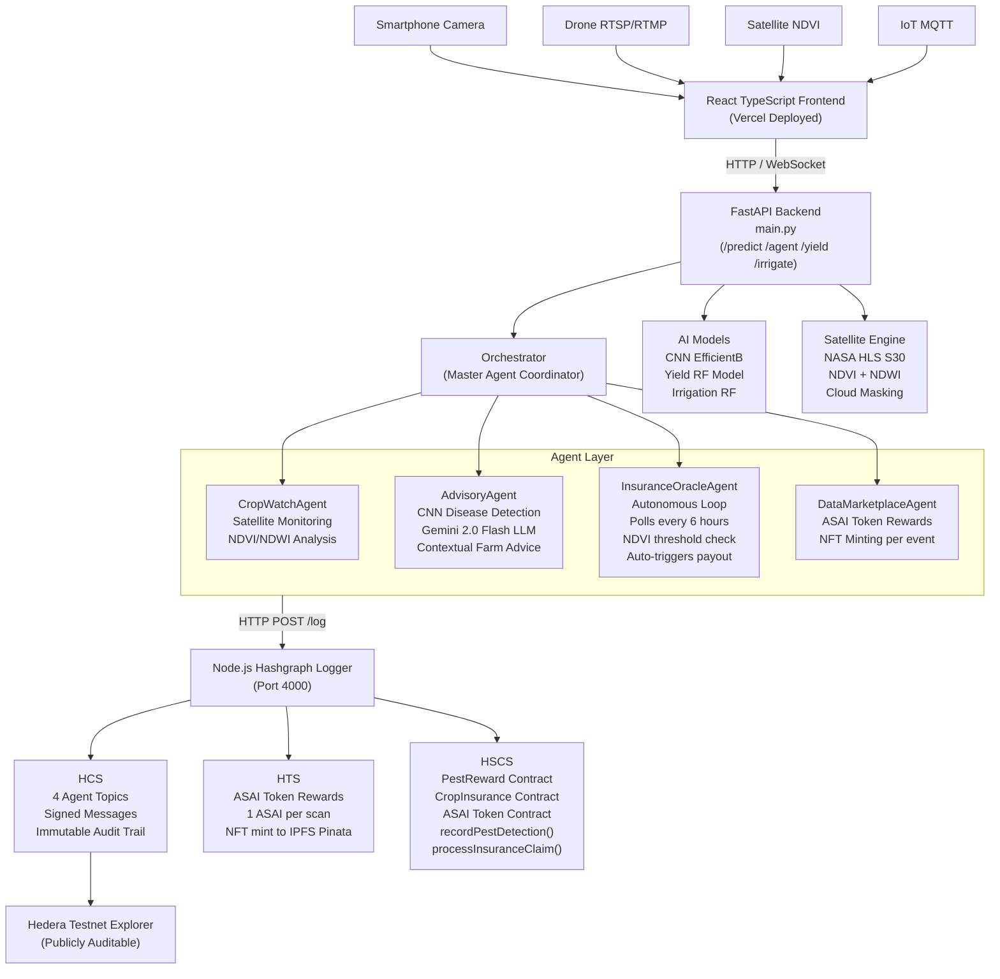
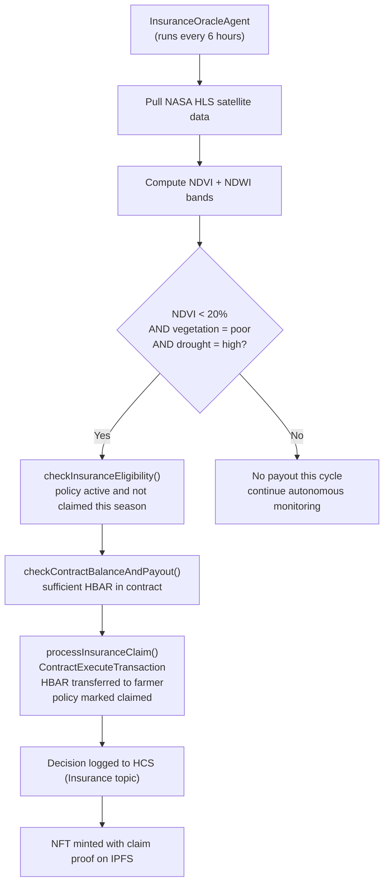

<div align="center">

# 🌱 AgriSense AI — Multi-Agent Precision Agriculture Platform

### *The First AI Agent Network for Smallholder Farmers, Powered by Hedera*

[](https://hedera.com)
[](https://fastapi.tiangolo.com)
[](https://tensorflow.org)
[](https://reactjs.org)
[](https://ai.google.dev)

**[🚀 Live Demo](https://agrisense-agents.vercel.app) · [🎬 Demo Video](https://youtu.be/Gq1DeSbOIIU) · [📊 Pitch Deck](AgriSense_AI_Pitch_Deck.pptx.pdf)**

> *Africa's smallholder farmers lose 40–50% of harvests to preventable pests, droughts, and data gaps — over $10B annually. AgriSense AI deploys a network of autonomous AI agents that think, decide, and act on behalf of farmers — detecting diseases, reasoning over satellite data, and triggering insurance payouts automatically. Every agent decision is logged immutably on Hedera HCS, creating the world's first fully auditable autonomous agricultural economy.*

</div>

---

## 📖 Table of Contents

- [The Agent Architecture](#-the-agent-architecture)
- [What Makes This Different](#-what-makes-this-different)
- [System Architecture Diagram](#-system-architecture-diagram)
- [Folder Structure](#-folder-structure)
- [Technology Stack](#-technology-stack)
- [Hedera Integration](#-hedera-integration)
- [Smart Contracts](#-smart-contracts)
- [Installation Guide](#-installation-guide)
- [API Reference](#-api-reference)
- [Deployed Hedera IDs](#-deployed-hedera-ids-testnet)
- [Agent Demo Walkthrough](#-agent-demo-walkthrough)
- [Team](#-team)

---

## 🤖 The Agent Architecture

AgriSense AI v1 introduces a **network of autonomous AI agents** that coordinate through Hedera HCS. Each agent has a defined role, a dedicated HCS topic, and can act independently without requiring a human to trigger every decision.

### The Four Agents

| Agent | Type | Role | Hedera Integration |
|-------|------|------|--------------------|
| **CropWatchAgent** | Reactive + Autonomous | Monitors crop health via satellite NDVI/NDWI analysis | Dedicated HCS topic — every observation logged |
| **AdvisoryAgent** | Reactive | Gemini 2.0-powered contextual expert advice from disease detections | HCS logging per advice generation |
| **InsuranceOracleAgent** | **Fully Autonomous** | Polls satellite data on a schedule, autonomously triggers HBAR insurance payouts via smart contract | HCS decision trail + HSCS execution |
| **DataMarketplaceAgent** | Reactive | Manages ASAI token rewards and NFT minting for every data contribution | HTS transfers + NFT collection minting |

### The Master Orchestrator

The **Orchestrator** coordinates all agents under a single farm analysis session. Send one request to `/agent/analyze` and it:

1. Dispatches **CropWatchAgent** → pulls NASA HLS satellite imagery → computes NDVI/NDWI
2. Dispatches **AdvisoryAgent** → runs CNN disease detection → calls Gemini with full farm context including NDVI, drought risk, and location
3. Logs every agent decision to its dedicated HCS topic
4. Returns a unified farm intelligence report

### Why This Matters for Hedera

Every agent action — detection, advice, oracle decision, insurance trigger — is a **signed message on a dedicated HCS topic**. Any farmer in rural Nigeria can go to the Hedera testnet explorer, find their farm's topic ID, and audit the exact chain of autonomous decisions that led to their insurance payout. **This is trustless autonomous agriculture.**

---

## ✨ How The Agent System Works

```
CropWatchAgent wakes autonomously
  → calls satellite tool → NDVI computed
  → logs decision to HCS (CropWatch topic)
  → signals Orchestrator

AdvisoryAgent receives detection
  → calls CNN tool → disease identified
  → calls Gemini with: disease + NDVI + drought_risk + location
  → generates dynamic contextual advice
  → logs advice decision to HCS (Advisory topic)

InsuranceOracleAgent (running every 6 hours)
  → pulls satellite NDVI autonomously
  → evaluates: NDVI < 20% + vegetation = poor + drought = high?
  → YES → calls smart contract → HBAR payout triggered
  → entire decision chain logged to HCS (Insurance topic)
  → farmer gets paid. No paperwork. No human approval.
```

---

## 🏗️ System Architecture Diagram



---

## 📁 Folder Structure

```
agrisense-agents/
│
├── main.py                          # FastAPI entry point — clean and modular
├── requirements.txt                 # Python dependencies
│
├── agents/                          # 🤖 The Agent Layer
│   ├── orchestrator.py              # Master agent — coordinates all sub-agents
│   ├── advisory_agent.py            # Gemini 2.0 Flash — dynamic contextual advice
│   ├── insurance_oracle_agent.py    # Autonomous loop — monitors NDVI, triggers payouts
│   ├── cropwatch_agent.py           # Satellite crop health monitoring
│   └── data_marketplace_agent.py    # Token rewards & data economy
│
├── api/
│   └── routes/
│       ├── agent_routes.py          # /agent/analyze, /agent/oracle/*, /agent/status
│       ├── predict_routes.py        # POST /predict — pest detection
│       ├── satellite_routes.py      # POST /analyze/vegetation
│       ├── yield_routes.py          # POST /yield/predict
│       ├── irrigation_routes.py     # POST /irrigation/predict
│       └── drone_routes.py          # RTSP/RTMP drone jobs + WebSocket
│
├── tools/                           # Agent tools — wrap ML models as callable functions
│   ├── disease_detection.py         # CNN inference wrapper
│   ├── satellite_analysis.py        # NDVI/NDWI analysis wrapper
│   ├── yield_prediction.py          # Yield model wrapper
│   └── irrigation_prediction.py     # Irrigation model wrapper
│
├── models/
│   ├── loaders.py                   # All model loading (Azure Blob Storage)
│   ├── class_indices.json           # 39 disease/crop class mappings
│   └── disease_info.json            # Fallback advice per disease class
│
├── core/
│   ├── config.py                    # Centralised env var management
│   ├── schemas.py                   # All Pydantic request/response models
│   └── hcs_logger.py                # Async HTTP client → Node.js /log
│
├── satellite_analysis/
│   └── services/
│       ├── analysis_engine.py       # NDVI/NDWI computation, health assessment
│       └── nasa_client.py           # NASA Earthdata HLS S30 imagery download
│
├── hardware/
│   ├── mqtt_handler.py              # MQTT broker — IoT sensor streaming
│   └── ws_manager.py                # WebSocket connection manager
│
├── hashgraph/                       # Node.js Hedera Integration Layer
│   ├── index.js                     # Express server — POST /log, POST /associate
│   ├── logger.js                    # Per-agent HCS topic routing + full Hedera pipeline
│   ├── config.json                  # Smart contract IDs
│   ├── create_token.js              # Script: create ASAI utility token
│   ├── create_collection.js         # Script: create NFT collection
│   ├── agents/
│   │   └── hcs_topics.js            # Per-agent HCS topic routing + topic creation
│   ├── services/
│   │   ├── hcs.js                   # HCS — topic create, signed message submit
│   │   ├── hts.js                   # HTS — token create, mint, transfer rewards
│   │   ├── hedera_service.js        # HSCS — smart contract interactions
│   │   ├── ipfs.js                  # Pinata IPFS — HIP-412 NFT metadata upload
│   │   └── nft.js                   # NFT collection create + per-prediction mint
│   └── utils/
│       └── hedera_keys.js           # Key parsing utilities
│
├── smart-contracts/                 # Solidity Smart Contracts
│   ├── contracts/
│   │   ├── ASAI.sol                 # ASAI utility token contract
│   │   ├── CropInsurance.sol        # Automated HBAR insurance payouts
│   │   └── PestReward.sol           # Pest detection bonus rewards
│   ├── scripts/
│   │   ├── deploy.js                # Deploy ASAI token
│   │   ├── deploy-insurance.js      # Deploy CropInsurance
│   │   ├── deploy-pestreward.js     # Deploy PestReward
│   │   ├── test-insurance.js        # Insurance flow tests
│   │   └── verify-deployment.js     # Contract verification
│   └── hardhat.config.js
│
└── frontend/                        # React TypeScript Frontend
    ├── src/
    │   ├── pages/
    │   │   ├── Homepage.tsx          # Landing page
    │   │   └── MainApp.tsx           # Main application shell
    │   ├── components/
    │   │   ├── Pages/
    │   │   │   ├── Dashboard/        # Farm dashboard + IoT connection panel
    │   │   │   ├── Workspace/        # Pest detection, yield, irrigation UI
    │   │   │   ├── FarmManagement/   # GPS boundary drawing + farm setup
    │   │   │   ├── Marketplace/      # ASAI token marketplace
    │   │   │   └── RewardCenter/     # Token rewards dashboard
    │   │   ├── Map/
    │   │   │   └── MapDrawingTool.tsx # GPS farm boundary drawing (Leaflet)
    │   │   └── homepage/             # Landing page sections
    │   ├── services/
    │   │   ├── api/                  # Backend API service layer
    │   │   ├── contractService.ts    # Smart contract interactions
    │   │   └── mirrorNode.ts         # Hedera mirror node queries
    │   ├── contracts/abis/           # Contract ABIs (ASAI, CropInsurance, PestReward)
    │   ├── hooks/                    # Camera, drone, sensor, wallet hooks
    │   └── contexts/
    │       ├── WalletContext.tsx      # Hedera wallet state
    │       └── ThemeContext.tsx       # Dark/light theme
    └── tailwind.config.js
```

---

## 🛠️ Technology Stack

### AI & Machine Learning
| Component | Technology | Detail |
|-----------|------------|--------|
| Disease Detection | TensorFlow/Keras + EfficientNetB3 | Custom CNN, 10.9M params, 50K+ PlantVillage images, 97.7% accuracy |
| Advisory Intelligence | **Gemini 2.0 Flash** | Dynamic contextual advice with farm context injection (NDVI, drought risk, location) |
| Yield Forecasting | XGBoost / RandomForest | Area, rainfall, temp, pesticide features → hg/ha prediction |
| Smart Irrigation | RandomForest Classifier | Soil moisture + temperature + humidity → ON/OFF recommendation |
| Satellite Analysis | NASA HLS S30 + earthaccess | B03/B04/B08 band extraction, NDVI/NDWI, Fmask cloud masking |

### Backend & Infrastructure
| Component | Technology | Detail |
|-----------|------------|--------|
| API Framework | FastAPI 2.0 | Async, modular router architecture |
| Agent Framework | Pure Python asyncio | No external agent framework — clean, auditable agent loops |
| Model Storage | Azure Blob Storage | .keras and .pkl model files on demand |
| Real-time Drone | FFmpeg + WebSocket | RTSP/RTMP frame capture → inference → live stream |
| IoT Streaming | MQTT (HiveMQ) | Farm sensor data streaming |
| Hedera Bridge | Node.js Express | Python → Node.js HTTP bridge for all Hedera operations |

### Blockchain & Web3
| Component | Technology | Detail |
|-----------|------------|--------|
| Consensus Layer | Hedera HCS | 4 dedicated agent topics — signed, immutable decision logs |
| Token Layer | Hedera HTS | ASAI fungible token — rewards per inference |
| Smart Contracts | Hedera HSCS + Solidity | 3 contracts: ASAI, PestReward, CropInsurance |
| NFT Layer | Hedera HTS NFT + IPFS | HIP-412 metadata per prediction — pinned via Pinata |
| SDK | @hashgraph/sdk (Node.js) | ECDSA key signing, contract execution, token transfers |

### Frontend
| Component | Technology | Detail |
|-----------|------------|--------|
| Framework | React 18 + TypeScript | Full type safety |
| Styling | Tailwind CSS | Dark aesthetic, emerald/amber accents |
| Maps | React Leaflet | GPS farm boundary drawing |
| Wallet | Hedera WalletConnect | MetaMask + Hedera testnet |
| Deployment | Vercel | Auto-deploy from main branch |

---

## 🔗 Hedera Integration

AgriSense AI uses all three Hedera network services — HCS, HTS, and HSCS — in a deeply integrated pipeline.

### HCS — Hedera Consensus Service

**Every agent decision is a signed, timestamped message on a dedicated HCS topic.**

Each of the four agents has its own topic:

| Agent | HCS Topic | What Gets Logged |
|-------|-----------|-----------------|
| CropWatchAgent | `TOPIC_CROPWATCH` | NDVI/NDWI values, vegetation health, drought risk |
| AdvisoryAgent | `TOPIC_ADVISORY` | Disease detected, confidence, Gemini advice source |
| InsuranceOracleAgent | `TOPIC_INSURANCE` | Oracle decision, claim eligibility, payout trigger |
| DataMarketplaceAgent | `TOPIC_MARKETPLACE` | Token rewards, NFT mints, yield/irrigation logs |

Every message is signed with the operator ECDSA key before submission — making each log tamper-proof and attributable. Sequence numbers provide ordering. Any judge can verify agent decisions on the Hedera testnet explorer.

### HTS — Hedera Token Service

- **ASAI Token** (fungible) — minted once, distributed per inference
- Every farmer earns **1 ASAI** per prediction (pest detection, yield, irrigation, satellite)
- Bonus rewards queued via the PestReward smart contract for disease detections above confidence threshold
- NFT minted per prediction with HIP-412 metadata uploaded to IPFS via Pinata

### HSCS — Hedera Smart Contract Service

Three Solidity contracts deployed on Hedera testnet via Hardhat:

**PestReward.sol** — Called when disease is detected (not healthy, not non-plant). Records detection on-chain and queues ASAI bonus reward for the farmer.

**CropInsurance.sol** — The most sophisticated contract. The InsuranceOracleAgent evaluates three conditions autonomously:
- NDVI < 20% (vegetation index below critical threshold)
- Vegetation health = "poor"
- Drought risk = "high" or "severe"

When all three are met, the agent calls `processInsuranceClaim()` which:
1. Checks policy eligibility (`getPolicy()`)
2. Verifies contract balance (`getContractBalance()`)
3. Calculates payout based on drought severity (`getPayoutAmount()`)
4. Executes HBAR transfer to farmer wallet
5. Marks policy as claimed for the season

**ASAI.sol** — ERC-20 compatible ASAI token contract managed via HTS.

---

## 📄 Smart Contracts

| Contract | Address (Testnet) | Purpose |
|----------|-------------------|---------|
| PestReward | `0.0.6915678` | Disease detection bonus rewards |
| CropInsurance | `0.0.6915696` | Automated HBAR insurance payouts |
| ASAI Token | `0.0.6915579` | Utility token contract |

### Insurance Claim Flow (Fully Autonomous)



---

## 🚀 Installation Guide

### Prerequisites

- Python 3.10+
- Node.js 18+
- Git
- Azure Blob Storage account (model weights)
- Hedera testnet account (ECDSA)
- Google Gemini API key
- Pinata account (IPFS)
- NASA Earthdata account (satellite imagery)

---

### Step 1: Clone the Repository

```bash
git clone https://github.com/Bigdreams415/agrisense-agents.git
cd agrisense-agents
```

---

### Step 2: Python Backend Setup

```bash
# Create and activate virtual environment
python -m venv venv
source venv/bin/activate  # Windows: venv\Scripts\activate

# Install dependencies
pip install -r requirements.txt
```

Create `.env` in the root `agrisense-agents/` folder:

```env
GEMINI_API_KEY=your_gemini_api_key
AZURE_STORAGE_CONNECTION_STRING=your_azure_connection_string
HASGRAPH_URL=http://localhost:4000/log
EARTHDATA_USERNAME=your_nasa_earthdata_username
EARTHDATA_PASSWORD=your_nasa_earthdata_password
BROKER_TYPE=cloud
```

Start the backend:

```bash
uvicorn main:app --reload
# API available at http://localhost:8000
# Docs at http://localhost:8000/docs
```

---

### Step 3: Hedera Hashgraph Setup

```bash
cd hashgraph
npm install
```

Create `hashgraph/.env`:

```env
HEDERA_OPERATOR_ID=0.0.XXXXXX
HEDERA_OPERATOR_KEY=your_ecdsa_hex_private_key

TOPIC_ID=0.0.XXXXXX
TOPIC_CROPWATCH=0.0.XXXXXX
TOPIC_ADVISORY=0.0.XXXXXX
TOPIC_INSURANCE=0.0.XXXXXX
TOPIC_MARKETPLACE=0.0.XXXXXX

UTILITY_TOKEN_ID=0.0.XXXXXX
NFT_COLLECTION_ID=0.0.XXXXXX
TOKEN_DECIMALS=2

PINATA_JWT=your_pinata_jwt
ENABLE_NFT=true
NFT_NAME=AgriSense AI NFT
NFT_SYMBOL=ASAI_NFT
NFT_CREATOR=AgriSense AI

CONFIG_PATH=config.json
PORT=4000
```

Create `hashgraph/config.json`:

```json
{
  "PEST_REWARD_CONTRACT": "0.0.XXXXXX",
  "CROP_INSURANCE_CONTRACT": "0.0.XXXXXX",
  "ASAI_TOKEN_CONTRACT": "0.0.XXXXXX"
}
```

**First-time setup — create Hedera resources:**

```bash
# Create ASAI utility token
node create_token.js

# Create NFT collection
node create_collection.js

# Create dedicated HCS topic per agent
node -e "import('./agents/hcs_topics.js').then(m => m.createAllAgentTopics())"
```

Copy the printed IDs into your `.env`, then start the server:

```bash
node index.js
# Hashgraph logger running at http://localhost:4000
```

---

### Step 4: Smart Contracts (Already Deployed)

The contracts are live on Hedera testnet. To redeploy:

```bash
cd smart-contracts
npm install

# Deploy all contracts
npx hardhat run scripts/deploy.js --network hedera_testnet
npx hardhat run scripts/deploy-insurance.js --network hedera_testnet
npx hardhat run scripts/deploy-pestreward.js --network hedera_testnet

# Verify deployment
node scripts/verify-deployment.js
```

---

### Step 5: Frontend Setup

```bash
cd frontend
npm install
```

Create `frontend/.env`:

```env
REACT_APP_API_URL=http://localhost:8000
REACT_APP_HASHGRAPH_URL=http://localhost:4000
REACT_APP_HEDERA_NETWORK=testnet
```

Start the frontend:

```bash
npm start
# Available at http://localhost:3000
```

---

## 🔌 API Reference

### Agent Endpoints

| Method | Endpoint | Description |
|--------|----------|-------------|
| `GET` | `/agent/status` | View all agents and their current status |
| `POST` | `/agent/analyze` | Run full farm analysis (Orchestrator → CropWatch + Advisory) |
| `POST` | `/agent/oracle/start` | Start autonomous Insurance Oracle loop for a farm |
| `POST` | `/agent/oracle/check` | Single on-demand oracle insurance check |
| `POST` | `/agent/oracle/stop/{farmer_id}` | Stop oracle loop for a farmer |
| `GET` | `/agent/oracle/status` | View active oracle loops |

### Core AI Endpoints

| Method | Endpoint | Description |
|--------|----------|-------------|
| `POST` | `/predict` | Disease detection from image upload (CNN + Gemini advice) |
| `POST` | `/analyze/vegetation` | Satellite NDVI/NDWI analysis for farm boundaries |
| `POST` | `/yield/predict` | Crop yield prediction |
| `POST` | `/irrigation/predict` | Smart irrigation recommendation |
| `POST` | `/api/drones/connect` | Connect drone (RTSP/RTMP) |
| `POST` | `/api/jobs` | Start drone analysis job |
| `WS` | `/ws/jobs/{job_id}` | WebSocket — live drone frame results |

### Example: Full Agent Farm Analysis

```bash
curl -X POST http://localhost:8000/agent/analyze \
  -F "farmer_id=0.0.6908555" \
  -F 'boundaries=[[7.4,9.0],[7.5,9.1]]' \
  -F "crop_type=maize" \
  -F "location_hint=Abuja, Nigeria" \
  -F "image=@/path/to/leaf_photo.jpg"
```

Response includes: vegetation health, NDVI, drought risk, disease detection, Gemini-generated advice, and HCS consensus timestamps for every agent action.

### Example: Start Insurance Oracle

```bash
curl -X POST http://localhost:8000/agent/oracle/start \
  -F "farmer_id=0.0.6908555" \
  -F 'boundaries=[[7.4,9.0],[7.5,9.1]]' \
  -F "crop_type=maize" \
  -F "interval_hours=6"
```

The oracle now runs every 6 hours autonomously. When NDVI drops below 20%, vegetation degrades to "poor", and drought risk reaches "high" — the smart contract fires automatically.

---

## 🌐 Deployed Hedera IDs (Testnet)

| Resource | Hedera ID |
|----------|-----------|
| Operator Account | `0.0.6537386` |
| ASAI Utility Token | `0.0.8308875` |
| NFT Collection | `0.0.8308897` |
| HCS Topic — CropWatchAgent | `0.0.8308940` |
| HCS Topic — AdvisoryAgent | `0.0.8308941` |
| HCS Topic — InsuranceOracleAgent | `0.0.8308942` |
| HCS Topic — DataMarketplaceAgent | `0.0.8308943` |
| PestReward Contract | `0.0.6915678` |
| CropInsurance Contract | `0.0.6915696` |
| ASAI Token Contract | `0.0.6915579` |

Verify any agent decision on the [Hedera Testnet Explorer](https://hashscan.io/testnet).

---

## 🎬 Agent Demo Walkthrough

### 1. Check Agent Status
```
GET /agent/status
```
See all four agents, their types, and the active oracle loops.

### 2. Run a Full Farm Analysis
```
POST /agent/analyze
```
Pass a farm boundary and optionally a leaf image. Watch the orchestrator coordinate CropWatch + Advisory agents and return a unified report with HCS proof.

### 3. Watch Gemini Advisory in Action
```
POST /predict
```
Upload any diseased leaf image. The response now contains AI-generated dynamic advice contextualised to the detection — not a hardcoded template.

### 4. Trigger the Insurance Oracle
```
POST /agent/oracle/check
```
Pass a farm boundary with poor vegetation. The oracle evaluates conditions, calls the smart contract if eligible, and returns the full decision trail with HCS consensus timestamp.

### 5. Verify on Hedera Explorer
Go to `https://hashscan.io/testnet/topic/0.0.8308942` (InsuranceOracleAgent topic) and see every autonomous insurance decision logged immutably.

---

## 🤝 Team

| Name | Role |
|------|------|
| **Joshua** | Founder & CEO — Full-Stack Engineer, AI/ML, Hedera Integration |
| **Favour Ogudu** | Co-Founder & Chief Data Officer — Data Science, Model Training |

*Final-year Computer Science students, University of Benin, Nigeria.*

---

## 📜 License

MIT License — see [LICENSE](LICENSE) for details.

---

<div align="center">

**Built for the Hedera Hello Future Apex Hackathon 2026**

*Theme 1: AI & Agents — Autonomous actors that think, transact, and collaborate on Hedera*

[](https://hedera.com)

</div>